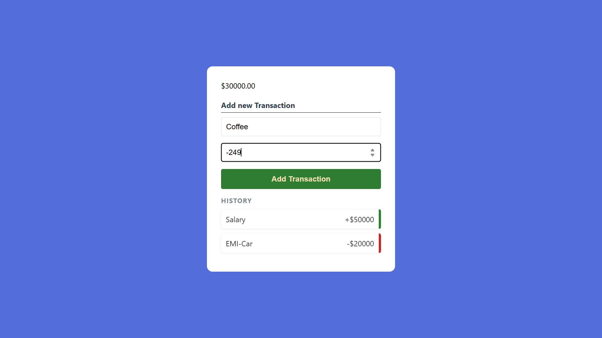

# 💰 Expense Tracker

A simple and responsive Expense Tracker built with HTML, CSS, and JavaScript. It allows users to add income and expense transactions, view transaction history, and track their current balance in real time.

## Features
- Add income and expense transactions
- Automatic balance calculation
- Transaction history
- Responsive and clean UI

## Tech Stack
- HTML
- CSS
- JavaScript

## How to Run
1. Clone the repository.
2. Open `index.html` in your browser.
3. Start adding your transactions!

## GLIMPSE-

